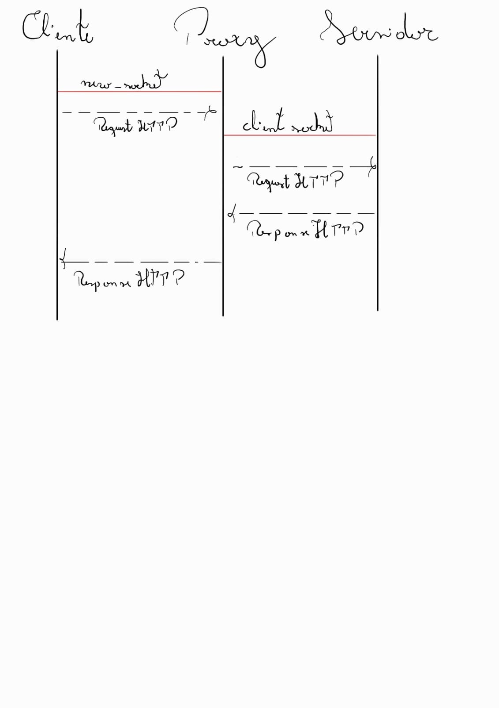

# Control 01
## Actividad: Construyamos un Proxy HTTP
**Integrantes:** Bastián Arias y Tomás León
**Repositorio:** https://github.com/Bastian-AAI/CC4303-Redes/tree/C1/Actividad-01
**Archivo principal:** `Actividad-01-Proxy/proxy.py`
**Informe:** `Actividad-0|-Proxy/README.md`

### 1. Descripción de la Solución e Implementación

En esta actividad se desarrolló un servidor Proxy HTTP intermediario en Python. Se utilizaron exclusivamente las librerías nativas `socket`, `json` y `sys` para gestionar las conexiones de red, cargar configuraciones y procesar los bytes de los mensajes HTTP.

#### Configuración del Socket y Flujo (Diagrama)

Para establecer la intermediación, el proxy requiere mantener dos sockets activos por cada petición:
1. **Socket Servidor:** Se utilizó un socket orientado a conexión (`SOCK_STREAM`) para escuchar en el puerto `8000`. Este atiende y acepta las peticiones entrantes desde el cliente (navegador o `curl`).
2. **Socket Cliente:** Al identificar el host de destino, se crea un segundo socket TCP que se conecta al puerto `80` del servidor web real para enviar la consulta, recibir la respuesta y posteriormente reenviarla al cliente original.

#### Filtros y Modificación de Contenido

El proxy implementa un parseo manual del protocolo HTTP que divide el mensaje en Start Line, Headers y Body. Utilizando esta estructura, aplica tres mecanismos:
1. **Bloqueo:** Verifica si el dominio solicitado está en la lista de bloqueados del archivo JSON. Si lo está, aborta la conexión a internet y retorna un código HTTP 403 junto a un HTML con una imagen local.
2. **Modificación de Headers:** Si la página está permitida, inyecta la cabecera `X-ElQuePregunta` asignándole el nombre del usuario configurado antes de enviar la petición.
3. **Censura y Reemplazo:** Al recibir la respuesta, si el `Content-Type` es `text/html`, decodifica el cuerpo, reemplaza las palabras prohibidas y actualiza el header `Content-Length` para que la modificación no corrompa la carga del mensaje.

### 2. Pruebas de Funcionalidad

Las pruebas ejecutadas contra el proxy fueron las siguientes:

1. **Prueba de inyección de Header (`cc4303.bachmann.cl`)**:
    - **Comando:** `curl -i http://cc4303.bachmann.cl/ -x 127.0.0.1:8000`
    - **Resultado:** El proxy resuelve correctamente la página. El servidor responde con el saludo utilizando el nombre configurado en el archivo JSON, demostrando la inyección exitosa de la cabecera `X-ElQuePregunta`.

2. **Prueba de reemplazo de palabras (`cc4303.bachmann.cl/replace`)**:
    - **Comando:** `curl -i http://cc4303.bachmann.cl/replace -x 127.0.0.1:8000`
    - **Resultado:** La página se renderiza completamente, pero las palabras clave (como proxy o DCC) aparecen censuradas (ej. `[REDACTED]`, `[FORBIDDEN]`). No hay cortes en la respuesta gracias al recálculo del `Content-Length`.

3. **Prueba de bloqueo de sitios (`cc4303.bachmann.cl/secret`)**:
    - **Comando:** `curl -i http://cc4303.bachmann.cl/secret -x 127.0.0.1:8000`
    - **Resultado:** El proxy intercepta la petición, no realiza consultas externas, y responde inmediatamente con un código `403 Forbidden` y el HTML personalizado que contiene la etiqueta ``.

4. **Prueba visual en Navegador (Firefox)**:
    - **Comando:** Acceso mediante Firefox configurado con proxy manual apuntando a `127.0.0.1:8000`.
    - **Resultado:** Al ingresar a la URL prohibida, el navegador muestra el mensaje de error y, en un segundo ciclo HTTP automático, solicita y carga exitosamente la imagen `images.jpg` almacenada de forma local.

### 3. Preguntas Teóricas del Enunciado

#### Ciclos HTTP de una imagen

- **¿Cuántos ciclos de comunicación HTTP son necesarios para mostrar una imagen en un navegador?**  
    Se necesitan **2 ciclos** completos de petición y respuesta.
- **¿Por qué?**  
    El primer ciclo solicita la ruta original y recibe el texto HTML (en este caso, el error 403 con la etiqueta ``). Al renderizar ese HTML, el navegador identifica que requiere los datos visuales y abre automáticamente una segunda petición `GET` solicitando exclusivamente el archivo de la imagen (`images.jpg`).

#### Manejo de buffer reducido (`recv_buffer = 50`)

- **¿Cómo sé que el HEAD llegó completo?**  
    El protocolo HTTP estipula que las cabeceras terminan estrictamente con un doble salto de línea (`\r\n\r\n`). El proxy itera concatenando los bytes recibidos hasta encontrar esta secuencia exacta.
- **¿Qué pasa si los headers no caben en mi buffer?**  
    El proxy utiliza un ciclo `while`. Sigue ejecutando llamadas al socket (`recv(50)`) y acumulando los bytes en memoria hasta que la condición de quiebre (el doble salto de línea) se cumple.
- **¿Y el BODY?**  
    Una vez que se tiene el HEAD completo, se extrae el valor numérico de la cabecera `Content-Length`. Este valor indica exactamente cuántos bytes componen el cuerpo del mensaje.
- **¿Cómo sé si llegó el mensaje completo?**  
    Al `Content-Length` se le restan los bytes del cuerpo que ya ingresaron en la lectura de las cabeceras. Luego, se realiza un nuevo ciclo iterativo pidiendo bytes hasta descargar la cantidad exacta restante.

### 4. Declaración de uso de Inteligencia Artificial

**Modelo utilizado:** Gemini de Google.

**Forma de uso:**
- Se utilizó para buscar y entender información específica de la materia de redes y el protocolo HTTP.
- Ayudó a resolver dudas puntuales respecto a las instrucciones y requisitos técnicos del enunciado de la actividad.
- Se empleó para la corrección ortográfica y la mejora de la redacción del presente informe.
